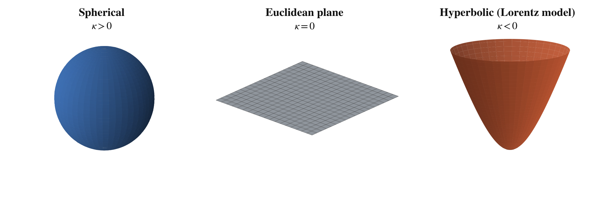
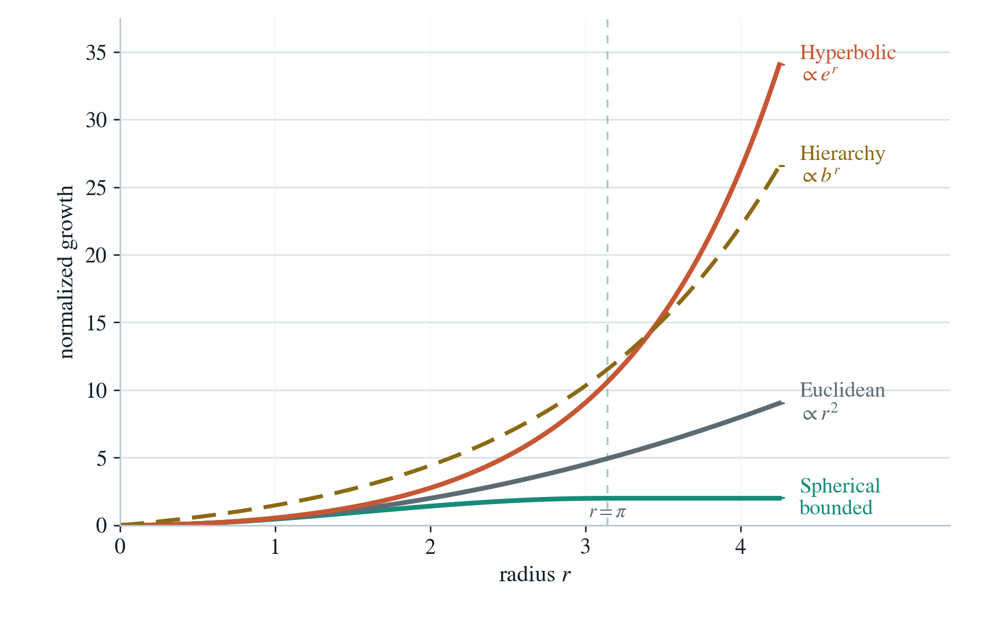
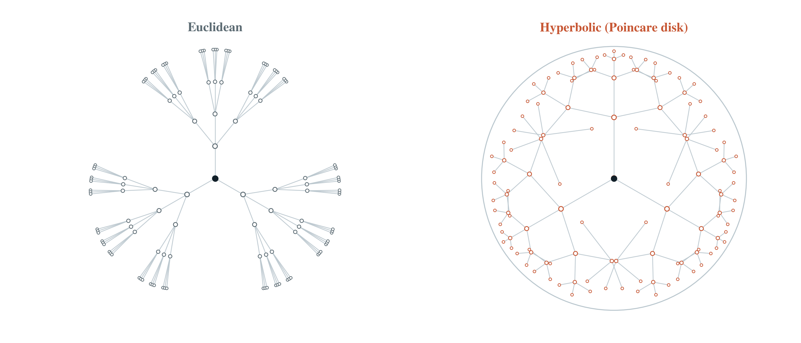
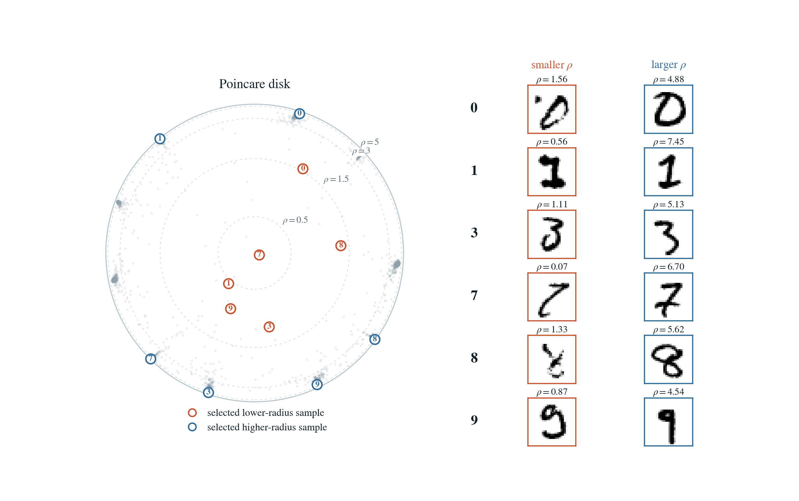

Mainstream ML is done on a Euclidean manifold, a choice that most people inherit as the status quo.

In this post, we explore other manifold choices, especially for embedding models.

Why do we need to look for different manifolds?

Different types of data fit into different manifolds much more efficiently.

- Hierarchical data fits into a hyperbolic manifold
- Periodic data fits into a hyperspherical manifold
- Flat or tabular data fits into a Euclidean manifold

## But what are these manifolds

A manifold is a space with its own geometry.
The space can be flat, positively curved, or negatively curved. Curvature changes how distances behave, how straight lines spread apart, and how much room the space creates as you move outward.

*Constant-curvature spaces: spherical has positive curvature, Euclidean has zero curvature, and hyperbolic has negative curvature.*

### Hyperspherical Embeddings

Periodic data is the easiest place to see why the default can be wrong. When you place phase on a Euclidean manifold, $2\pi$ and $0$ end up at opposite ends of a straight line, implying that they are very different from each other. In reality, the opposite is true, and that only becomes obvious when phase lies on a circle $S^1$.

The same logic scales up for hyperspherical embeddings which are a natural fit when the data is angular or periodic.

Some production models already live there: re-identification embedders like MegaDescriptor emit unit-norm features that sit on a hypersphere, and angular quantization schemes encode those features more efficiently than a Euclidean grid does.

### Hyperbolic Embeddings

Hierarchical data is where the geometry mismatch starts to hurt — and hierarchy is everywhere: taxonomies, category trees, file systems, scene–object–part containment, image–caption pairs. Most datasets carry at least an implicit hierarchy.

In $d$-dimensional Euclidean space, the volume of a ball of radius $r$ grows polynomially:

$$V_E(r) \propto r^d$$

In contrast, in hyperbolic space, the volume grows exponentially:

$$V_H(r) \propto e^r$$

Since hierarchical, tree-like branching data grows exponentially, the geometric mismatch becomes mathematically clear.

*The Euclidean manifold growth rate cannot match that of the hierarchical data (dashed lines), whereas the hyperbolic one does*

To compensate for this mismatch and accommodate hierarchical data, we often increase the dimensionality of Euclidean embeddings. This is one reason thousand-dimensional embeddings have become common. Google's [Gemini Embedding 2](https://docs.cloud.google.com/vertex-ai/generative-ai/docs/models/gemini/embedding-2), for example, defaults to `3072` dimensions.

You can also see the mismatch directly. Keep the same branching factor and the same local step size, and the Euclidean layout starts squeezing outer branches into narrower wedges. Negative curvature keeps creating room.

*The same branching tree crowds in Euclidean space and spreads more naturally in hyperbolic space.*

## Dimensional Efficiency

When the geometry matches the data, you can often represent the same structure with fewer dimensions.

The cleanest example is a hierarchical dataset like WordNet paired with a hyperbolic manifold.

We use WordNet because it is the standard benchmark for noun hierarchies. A `poodle` is a `dog`, which is an `animal`.

Following the original Poincare Embeddings paper (Nickel and Kiela), we use a reconstruction task: given a noun, rank candidate parents by distance in the embedding space.

Concretely, for the query `poodle`, we rank all candidate nouns by distance and record where a correct parent appears. The metric is reconstruction mean rank, so lower is better.

Following Nickel and Kiela (2017), we reproduce the same experiment:

| Dimension | Euclidean MR | Poincare MR |
|---:|---:|---:|
| 5 | 3542.3 | 4.9 |
| 10 | 2286.9 | 4.02 |
| 20 | 1685.9 | 3.84 |
| 50 | 1281.7 | 3.98 |
| 100 | 1187.3 | 3.90 |
| 200 | 1157.3 | 3.83 |

## Radius Can Encode Specificity

One of the nicest side effects of a hierarchy-aware hyperbolic embedding is that radius can start to mean something.

Closer to the center, you often get broader and more ambiguous points. Farther out, you often get more specific points. Once the geometry and the task both care about hierarchy, radius stops being a meaningless norm and starts becoming a useful inspection signal. If radius is telling you something about specificity, you can use it to triage ambiguous samples.

To illustrate this, we use the MNIST dataset, which contains ambiguous and low-quality examples. The figure below compares high-radius samples with low-radius samples.

*Within the same digit class, lower-radius examples tend to look less canonical while higher-radius examples look more prototypical.*
