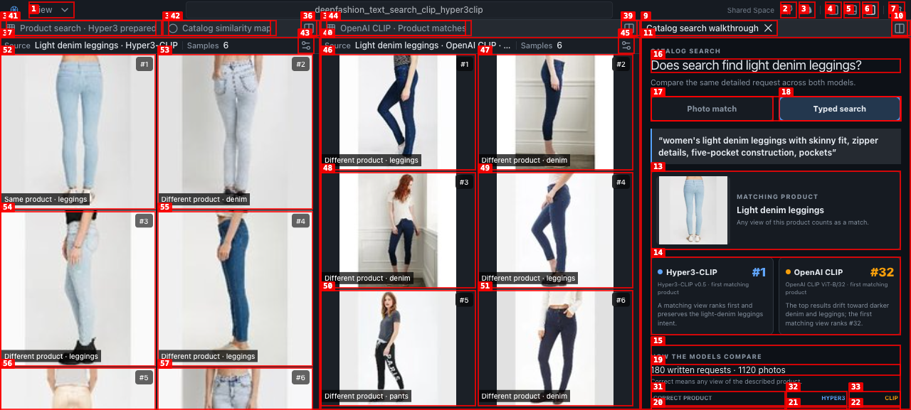
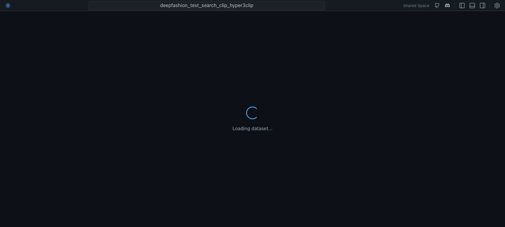
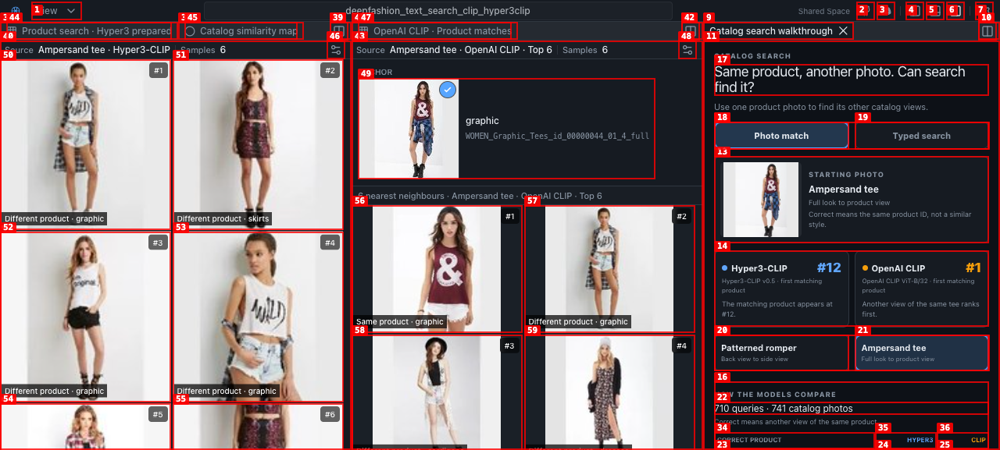
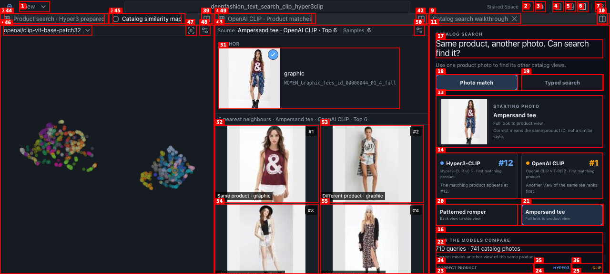
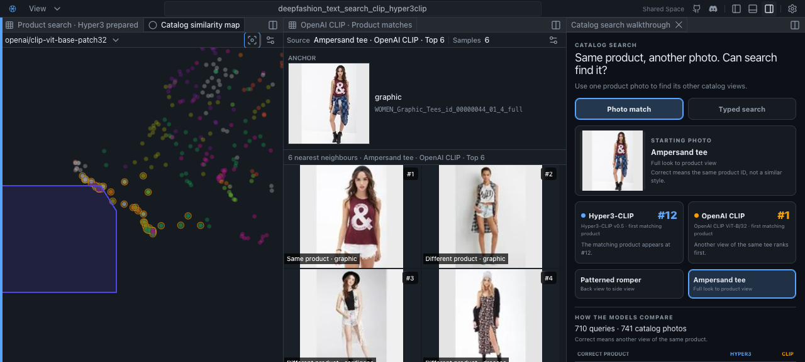
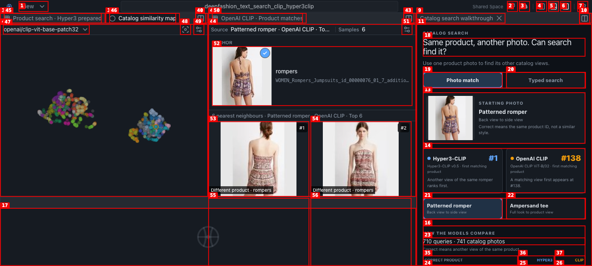

# Dogfood Report: Fashion Products Shared Space

| Field | Value |
|-------|-------|
| **Date** | 2026-08-29 |
| **App URL** | http://127.0.0.1:3001/spaces/fashion-products/ |
| **Session** | fashion-aug29 |
| **Scope** | Ecommerce search/merchandising review of the static, read-only Space: prepared photo matching and text retrieval evidence, real Samples panels, anchor/selection behavior, Catalog similarity map, custom walkthrough panel, and browser errors. |

## Summary

| Severity | Count |
|----------|-------|
| Critical | 0 |
| High | 0 |
| Medium | 3 |
| Low | 1 |
| **Total** | **4** |

## Business question and overall assessment

**Business question:** Can an apparel team use image matching and written shopper requests to find the same catalog product across photos, preserve shopper intent, and compare Hyper3-CLIP with the OpenAI CLIP baseline before promoting a retrieval model?

**Score: 8/10.** The Space answers the question clearly with two concrete photo cases, a prepared text request, ranked result grids, and benchmark metrics. The right-side walkthrough is prominent, media loads, and the read-only boundary is honest (no text input or run/query affordance). Native map pan, wheel zoom, point click, and Shift-drag lasso all work. The score is held back by one missing anchor presentation in the Hyper3 Ampersand case, a map that only exposes the OpenAI CLIP embedding despite the model comparison, and weak feedback after lasso selection.

## Verified passes

- Patterned romper case: Hyper3-CLIP ranks another view of the same product at **#1**; OpenAI CLIP first matches at **#138**. Both Samples panels show anchor/media and six labeled results.
- Ampersand tee case: Hyper3-CLIP first matching product **#12**; OpenAI CLIP **#1**. The result panels update and images load; the missing Hyper3 anchor card is documented below.
- Typed-search tab shows a fixed, detailed “light denim leggings” request and result evidence/metrics; there are **0** inputs or textareas, so static mode does not imply live inference.
- All 15 images were complete with `naturalWidth > 0`; observed document/runtime/data/panel/image requests were HTTP 200; `agent-browser errors` and `console` returned no entries.
- Native pan, wheel zoom, point selection, and Shift-drag lasso were exercised on the Catalog similarity map. The lasso rendered a polygon and highlighted multiple points (`map-lasso-playwright.png`).
- The custom walkthrough stays in the right-side panel and scrolls independently to expose the benchmark table (`custom-panel-scrolled.png`).

## Issues

<!-- Copy this block for each issue found. Interactive issues need video + step-by-step screenshots. Static issues (typos, visual glitches) only need a single screenshot -- set Repro Video to N/A. -->

### ISSUE-001: Hyper3-CLIP Ampersand case omits the anchor card

| Field | Value |
|-------|-------|
| **Severity** | medium |
| **Category** | visual / content |
| **URL** | http://127.0.0.1:3001/spaces/fashion-products/ |
| **Repro Video** | `videos/photo-case-repro.webm` |

**Description**

After clicking the prepared “Ampersand tee — Full look to product view” case, the OpenAI CLIP Samples panel retains a clear `ANCHOR` card (graphic SKU + image), but the Hyper3-CLIP panel jumps directly from its header to the six result tiles. The walkthrough still says the case is an image-to-image comparison, so both model panels should expose the same source anchor for an apples-to-apples review. The result data itself is present and labeled.

**Repro Steps**

<!-- Each step has a screenshot. A reader should be able to follow along visually. -->

1. Navigate to the Space and wait for the Patterned romper case.
   

2. Click **Ampersand tee — Full look to product view** in the walkthrough.
   

3. Compare the two Samples panels after the state settles.
   

4. **Observe:** OpenAI CLIP shows an anchor card for the graphic SKU; Hyper3-CLIP has no anchor card.
   

---

### ISSUE-002: Similarity map exposes only the baseline embedding

| Field | Value |
|-------|-------|
| **Severity** | medium |
| **Category** | ux / content |
| **URL** | http://127.0.0.1:3001/spaces/fashion-products/ |
| **Repro Video** | N/A |

**Description**

The business story compares Hyper3-CLIP and OpenAI CLIP, but the Catalog similarity map dropdown contains only `openai/clip-vit-base-patch32`. A stakeholder can inspect the baseline catalog topology, yet cannot compare how Hyper3 organizes the same products. The map is useful, but its scope should be explicit or a Hyper3 layout should be available.

**Repro Steps**

1. Click **Catalog similarity map** in the top-left view tabs.
   
2. **Observe:** the embedding selector has one option, `openai/clip-vit-base-patch32`, while the surrounding evidence compares two models.

---

### ISSUE-003: Lasso selection has no business-facing result feedback

| Field | Value |
|-------|-------|
| **Severity** | medium |
| **Category** | functional / ux |
| **URL** | http://127.0.0.1:3001/spaces/fashion-products/ |
| **Repro Video** | N/A |

**Description**

Shift-drag lasso works at the map level: a polygon is drawn and multiple points are highlighted. However, the Samples panels and walkthrough remain unchanged and the UI does not show how many catalog photos were selected (the labels area still reads `1`). A merchandising user cannot tell what the lasso selection means or where to inspect the selected cohort. If selection is intentionally view-only, the Space should say so; otherwise expose a selected count/results panel.

**Repro Steps**

1. Open **Catalog similarity map** and Shift-drag around the left cluster.
2. **Observe:** the polygon and highlighted points appear, but no selected-count or downstream result state is surfaced.
   

---

### ISSUE-004: Empty bottom-panel toggle consumes half the evidence viewport

| Field | Value |
|-------|-------|
| **Severity** | low |
| **Category** | visual / ux |
| **URL** | http://127.0.0.1:3001/spaces/fashion-products/ |
| **Repro Video** | N/A |

**Description**

The generic **Toggle bottom panel** control opens a large empty bottom region when this Space has no bottom content, compressing the map and result grids. It is reversible and not part of the default layout, but it is a confusing dead area for a first-time reviewer.

**Repro Steps**

1. Click **Toggle bottom panel** in the HyperView toolbar.
2. **Observe:** a blank lower panel opens and reduces the primary evidence area.
   

---
