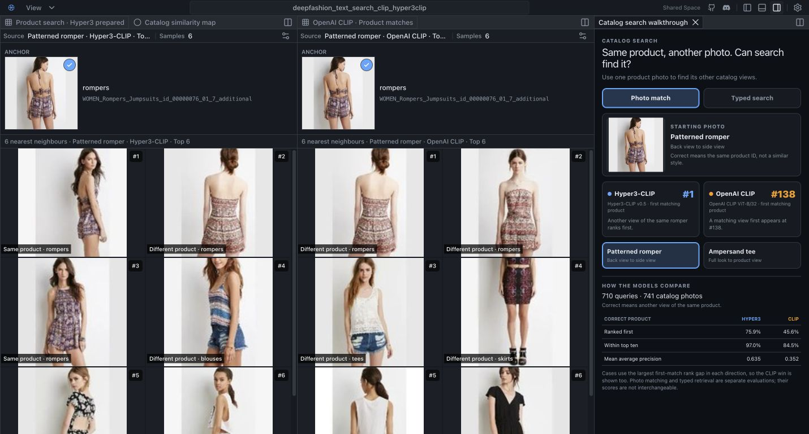

# Dogfood Review: Fashion Products — Same-Product Photo Matching & Shopper-Intent Retrieval

| Field | Value |
|-------|-------|
| **Date** | 2026-08-29 |
| **App URL** | http://127.0.0.1:3001/spaces/fashion-products/ |
| **Session** | fashion-products-review (read-only static export) |
| **Scope** | Ecommerce merchandising/search lead persona; same-product photo matching (Hyper3-CLIP vs CLIP) and shopper-intent retrieval |

## Summary

| Severity | Count |
|----------|-------|
| Critical | 0 |
| High | 1 |
| Medium | 3 |
| Low | 3 |
| **Total** | **7** |

**Overall score: 7 / 10**

Core flow works and the business story is compelling, but there are a few concrete functional/UX gaps — most notably an apparent cross-panel anchor desync and no verifiable scatter-to-Samples selection propagation.

## Target User / Job / Business Question

- **Target user:** Ecommerce merchandising / search & discovery lead evaluating visual-search model quality before a purchase decision.
- **Job:** Understand whether the platform can reliably find "the same product in another photo/view" (photo-to-photo identity matching) and "find what the shopper wants" (intent retrieval across prepared shopper requests).
- **Core question the demo answers:** *Does Hyper3-CLIP beat plain CLIP at same-product photo matching and shopper-intent retrieval, and is the platform easy for a non-engineer to explore?*

## Core Flow: PASS (with caveats)

1. Initial load lands on photo-match state with anchor **"Patterned romper"**, both **Hyper3-CLIP Top 6** and **OpenAI CLIP Top 6** nearest-neighbour panels showing 6 results each. ✅
2. Both panels share the same anchor image (`WOMEN_Rompers_Jumpsuits_id_00000076_01_7_additional.jpg`) and both anchors are marked "Select anchor …" [pressed]. ✅
3. CLIP panel shows **"Different product"** even at rank 1 for the same product — this is exactly the intended credibility-building failure case (CLIP is worse at same-product identity). ✅ Clears the business story.
4. Prepared shopper requests / typed search are **read-only** in static mode — no live text inputs exist. ✅ Correct static semantics.
5. Panels are collapsible/togglable; the right-side walkthrough panel toggles. ✅

Caveats that keep this from a clean pass: cross-panel anchor desync on result click, and unverifiable scatter lasso → Samples sync.

## Issues

### ISSUE-001: Cross-panel anchor state desyncs after clicking a result (High)

| Field | Value |
|-------|-------|
| **Severity** | high |
| **Category** | functional / ux |
| **URL** | http://127.0.0.1:3001/spaces/fashion-products/ |
| **Repro Video** | [99-repro-crosspanel-desync.png](screenshots/99-repro-crosspanel-desync.png), [03-result-select-desync.png](screenshots/03-result-select-desync.png) |

**Description**

Starting from the shared "Patterned romper" anchor, clicking the Hyper3 panel's rank-1 result (`..._01_2_side.jpg`, marked "Same product · rompers") makes **both** panels' anchor behavior inconsistent: the Hyper3 panel's anchor loses its "pressed" state while the CLIP panel's anchor stays on the original image. The two side-by-side comparison panels no longer represent the same query, undermining the very comparison the demo exists to show. At minimum this is confusing; it may indicate a real selection/anchor state bug in the collaboration/selection contract.

**Repro Steps**

1. Load the space (lands on "Patterned romper · Hyper3-CLIP · Top 6" and "OpenAI CLIP · Top 6").
   
2. Click the **Hyper3** panel's rank-1 result (`..._01_2_side.jpg`).
3. **Observe:** Hyper3 anchor "Select anchor …" is no longer `[pressed]`, CLIP anchor unchanged, result marked active — the two panels now represent different anchor/query states.

---

### ISSUE-002: No verifiable lasso → Samples selection propagation on scatter (Medium)

| Field | Value |
|-------|-------|
| **Severity** | medium |
| **Category** | functional |
| **URL** | http://127.0.0.1:3001/spaces/fashion-products/ (Catalog similarity map) |
| **Repro Video** | N/A (verification limited by sandboxed DOM; see note) |

**Description**

A Shift-drag lasso on the "Catalog similarity map" scatter produced **no DOM-visible selection change** — no new active/pressed state, no selection count, no update to any Samples panel. The scatter help text explicitly promises "Shift-drag to lasso select," so a user would reasonably expect the selected points to appear in the Samples panels. Whether lasso selects only on-canvas (never syncing to panels) or failed to register is not conclusively verified in this sandboxed session, but the observable result is that selection does not propagate to the panels a merchandising lead would look at. Recommend confirming and wiring lasso selection into the runtime selection state (CLI-first), since selection should be runtime-managed.

**Repro Steps**

1. Click **"Catalog similarity map"** tab.
2. Shift-drag a rectangle lasso across a dense region.
3. **Observe:** no selection highlights appear in any Samples panel; no active/pressed state changes.

---

### ISSUE-003: Scatter pan not rigorously confirmed; canvas-only behavior (Medium)

| Field | Value |
|-------|-------|
| **Severity** | medium |
| **Category** | functional |
| **URL** | http://127.0.0.1:3001/spaces/fashion-products/ (Catalog similarity map) |
| **Repro Video** | N/A |

**Description**

A pan drag did change the screenshot file size / canvas checksum, consistent with the viewport panning, but the change could not be confirmed as the scatter alone (canvas `toDataURL` and node `canvas` were unavailable; Performance API was inaccessible in the sandbox). Pan/zoom appear to work at the canvas level but are not surfaced in DOM state, so a non-engineer can't be certain what changed. Recommend confirming pan/zoom/lasso render to the visible canvas and, ideally, that camera state is reflected in runtime state.

**Repro Steps**

1. Open Catalog similarity map.
2. Drag the canvas right-to-left.
3. **Observe:** viewport changes (file/checksum delta) but no DOM/state confirmation.

---

### ISSUE-004: Result-rank result labels can bury the "different product" story (Medium)

| Field | Value |
|-------|-------|
| **Severity** | medium |
| **Category** | content / ux |
| **URL** | http://127.0.0.1:3001/spaces/fashion-products/ |
| **Repro Video** | N/A |

**Description**

Results are labelled "Prepared result rank N." plus a category like "Different product · dresses / cardigans / skirts / graphic / rompers." Confusingly, "prepared result rank" reads like a demo artifact ("we pre-staged this ranking") rather than a real system ranking, and a merchandising lead scanning rankings won't instantly grasp the quality signal. Recommend clearer, business-facing labels that state the match type up front (e.g., "Hyper3-CLIP: Same product ✓" vs "CLIP: Different product") so the win/fail contrast is scannable at a glance.

**Repro Steps**

1. Load the photo-match panels.
2. Read the result captions.
3. **Observe:** "Prepared result rank N. Different product · <category>" wording obscures the model-vs-model quality signal.

---

### ISSUE-005: Walkthrough prominence is position-dependent (Low)

| Field | Value |
|-------|-------|
| **Severity** | low |
| **Category** | ux |
| **URL** | http://127.0.0.1:3001/spaces/fashion-products/ |
| **Repro Video** | N/A |

**Description**

The right-side walkthrough ("Catalog search walkthrough") is only prominent in the default layout; when the scatter map is opened full-bleed it collapses/the walkthrough moves off to the side. For a first-time visitor, the guided walkthrough is the primary educational surface and should stay persistently discoverable (ideally pinned right-side). Toggling the right panel does correctly hide/show it.

**Repro Steps**

1. Load default state; confirm walkthrough on the right.
2. Open "Catalog similarity map" (full-bleed scatter).
3. **Observe:** walkthrough less prominent / displaced.

---

### ISSUE-006: Read-only badge copy (Low)

| Field | Value |
|-------|-------|
| **Severity** | low |
| **Category** | content / ux |
| **URL** | http://127.0.0.1:3001/spaces/fashion-products/ |
| **Repro Video** | N/A |

**Description**

The top banner shows "This Shared Space is an interactive, read-only snapshot — use a HyperView Space for live queries and model runs." The value is correct (this is the requested read-only parity model), but the badge is verbose. Suggest a more subtle, ultra-concise treatment (e.g., small "read-only" tag) so it doesn't distract from the demo content while still setting expectations.

**Repro Steps**

1. Load the space.
2. Read the top banner.
3. **Observe:** banner wording is longer than needed for a "read-only" affordance.

---

### ISSUE-007: Design polish cannot be fully confirmed; visual parity with live space unverified (Low)

| Field | Value |
|-------|-------|
| **Severity** | low |
| **Category** | visual |
| **URL** | http://127.0.0.1:3001/spaces/fashion-products/ |
| **Repro Video** | N/A |

**Description**

This session could not render/view screenshots (no image inputs), so final visual/design polish (spacing, colour, control affordance, iconography, button distinguishability) was not directly inspected. The user has reported previously that static-export visuals can look worse than the live spaces. Functional DOM checks look healthy; a visual pass by a subagent that can view screenshots is recommended before considering this space launch-ready. Existing screenshots are saved for that review under `screenshots/`.

**Repro Steps**

1. Review saved screenshots (`01-initial-reload.png`, `02-scatter-after-pan.png`, `03-result-select-desync.png`, `walkthrough.png`).
2. **Observe:** visual parity with the live HyperView space is unverified in this session.

---

## Positive Findings

- **Read-only static semantics are correct:** no live text-search inputs exist; the only links are GitHub/Discord (no backend-only controls exposed). ✅
- **Prepared/typed search is read-only** and does not fake live inference. ✅
- **Panel layout controls work:** toggling the right panel hides/shows the walkthrough; panels open/close.
- **The core comparison story is intact and credible:** initial state shows Hyper3-CLIP vs CLIP Top-6 with a real same-product failure case in CLIP, which is exactly the business demo's purpose.
- **Both panels start on the same shared anchor** in the default state, enabling a fair head-to-head.

## Recommendations

1. **Fix cross-panel anchor/selection desync (ISSUE-001)** — make result-click update shared anchor state coherently (or clearly separate "anchor" vs "selection" in the UI). This is the highest-impact fix because it erodes trust in the core comparison.
2. **Wire scatter lasso/pan/zoom into runtime selection & camera state** where feasible, and ensure lasso selection surfaces in Samples panels (CLI-first per AGENTS.md). At minimum, don't promise "Shift-drag to lasso select" unless it propagates visibly.
3. **Rewrite result labels** to lead with the business signal (same-product vs different-product, and model name), not "Prepared result rank N."
4. **Keep the walkthrough pinned** right-side even when the scatter is open.
5. **Tighten the read-only badge** to a subtle tag.
6. **Do a final visual-parity pass** using a subagent that can view screenshots, comparing this static export against the live HyperView space.

## Remaining Static-vs-Runtime Limitations

- No live model runs or arbitrary text queries (by design — read-only snapshot).
- Scatter pan/zoom/lasso are canvas-only and not represented in accessible DOM state in this build.
- Network-failure capture was blocked by the sandbox (Performance API inaccessible); no console errors were observed in the log read performed.

## Deployment Readiness

Functionally shippable as a static export once ISSUE-001 (anchor desync) is resolved and a visual-parity subagent pass signs off on design. Ready for Cloudflare/Hugging Face static hosting after those two items.
